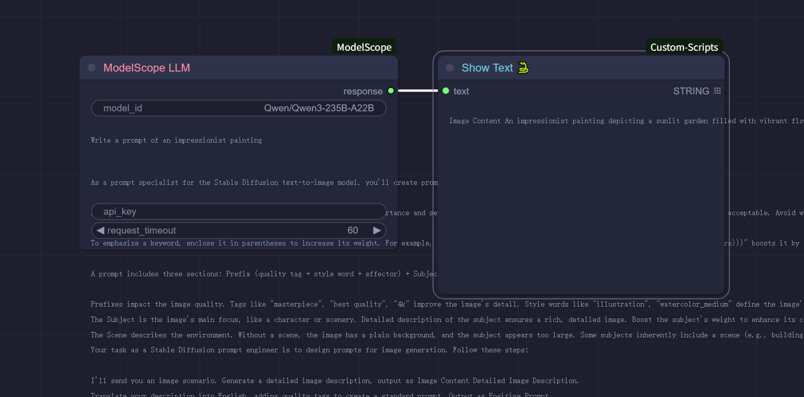

# ComfyUI-ModelScope

A ComfyUI custom node package for ModelScope API integration, providing seamless access to ModelScope's powerful AI models including Large Language Models (LLM), Vision-Language Models (VLM), and Image Generation capabilities.

## About ModelScope

ModelScope is a comprehensive AI model platform that offers state-of-the-art models for various AI tasks. This ComfyUI integration provides direct access to ModelScope's API inference services, enabling you to leverage powerful models like Qwen series without local model deployment.

## Features

- **Large Language Model (LLM)**: Generate text responses using ModelScope's chat completion models
- **Vision-Language Model (VLM)**: Analyze images with text prompts using advanced multimodal models
- **Text-to-Image Generation**: Create high-quality images from text descriptions
- **Enhanced Error Handling**: Robust timeout management and SSL configuration
- **Input Validation**: Comprehensive validation with helpful tooltips and placeholders
- **Text Sanitization**: Automatic text cleaning for ComfyUI showText node compatibility
- **Configurable Timeouts**: Adjustable request timeouts optimized for different model types

## Installation

### 1. Install the Extension

Download or git clone this repository inside `ComfyUI/custom_nodes/` directory:

```bash
git clone https://github.com/neverbiasu/ComfyUI-ModelScope.git
```

Or use the ComfyUI Manager for automatic installation.

### 2. Install Dependencies

The extension requires the following Python packages:

```bash
pip install -r requirements.txt
```

### 3. API Configuration

You'll need a ModelScope API key to use these nodes. You can obtain one from [ModelScope](https://www.modelscope.cn/).

Set your API key in one of these ways:
- Set the `MODELSCOPE_API_KEY` environment variable
- Set the `MODELSCOPE_ACCESS_TOKEN` environment variable
- Provide the API key directly in the node's api_key field

### 4. Restart ComfyUI

Restart ComfyUI to load the new nodes.

## Example Workflows

### Text Generation Workflow

Use the ModelScope LLM node to generate creative text, answer questions, or perform text processing tasks.

### Vision-Language Understanding Workflow

Analyze images and answer questions about their content using advanced vision-language models.

### Text-to-Image Generation Workflow

Generate custom images from text descriptions with fine-tuned control over output parameters.

## Related Links

- [ModelScope Platform](https://www.modelscope.cn/)
- [ModelScope API Documentation](https://www.modelscope.cn/docs)
- [ComfyUI](https://github.com/comfyanonymous/ComfyUI)
